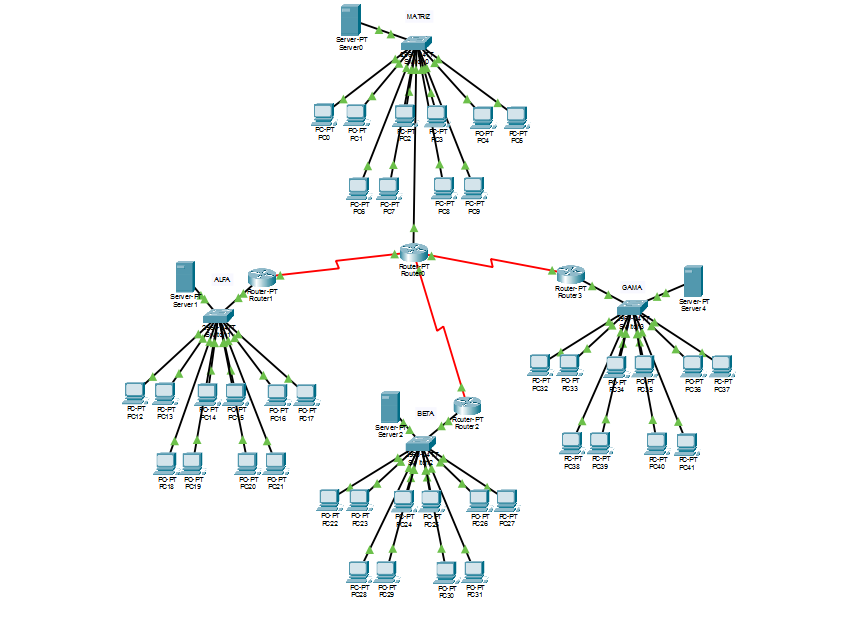
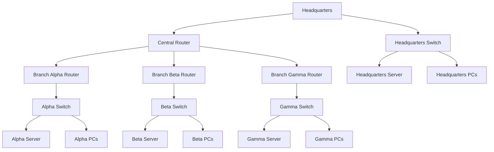

<div align="center">

# Corporate Network Infrastructure

### Multi-Branch Network Architecture

A corporate network infrastructure project designed to connect a headquarters office to three branches using routing, LAN/WAN segmentation, centralized services, and automated IP addressing.



</div> 

<div align="center">


</div>

---

## Project Snapshot

<table>
  <tr>
    <td><strong>Project Type</strong></td>
    <td>Corporate network infrastructure simulation</td>
  </tr>
  <tr>
    <td><strong>Main Goal</strong></td>
    <td>Connect a headquarters office with three branch offices through an organized and scalable network architecture</td>
  </tr>
  <tr>
    <td><strong>Tool Used</strong></td>
    <td>Cisco Packet Tracer</td>
  </tr>
  <tr>
    <td><strong>Network Model</strong></td>
    <td>Hierarchical and distributed topology</td>
  </tr>
  <tr>
    <td><strong>Main Concepts</strong></td>
    <td>Routing, LAN/WAN segmentation, DHCP, client-server architecture, IP addressing</td>
  </tr>
  <tr>
    <td><strong>Scenario</strong></td>
    <td>Headquarters connected to three branches: Alpha, Beta and Gamma</td>
  </tr>
</table>

---

## Navigation

<table>
  <tr>
    <td><a href="#overview"><strong>Overview</strong></a><br>What this network project represents.</td>
    <td><a href="#why-this-project-matters"><strong>Why This Project Matters</strong></a><br>The technical value behind the simulation.</td>
  </tr>
  <tr>
    <td><a href="#network-architecture"><strong>Network Architecture</strong></a><br>Main components of the infrastructure.</td>
    <td><a href="#topology"><strong>Topology</strong></a><br>How the headquarters and branches are connected.</td>
  </tr>
  <tr>
    <td><a href="#ip-addressing"><strong>IP Addressing</strong></a><br>How IP assignment was organized.</td>
    <td><a href="#technologies-and-concepts"><strong>Technologies</strong></a><br>Tools and networking concepts used.</td>
  </tr>
  <tr>
    <td><a href="#main-features"><strong>Main Features</strong></a><br>What the network is able to provide.</td>
    <td><a href="#project-structure"><strong>Project Structure</strong></a><br>Logical organization of the environment.</td>
  </tr>
  <tr>
    <td><a href="#use-case"><strong>Use Case</strong></a><br>The real-world scenario simulated by the project.</td>
    <td><a href="#key-learnings"><strong>Key Learnings</strong></a><br>Concepts practiced during the implementation.</td>
  </tr>
  <tr>
    <td><a href="#future-improvements"><strong>Future Improvements</strong></a><br>Ideas to evolve the network design.</td>
    <td><a href="#final-note"><strong>Final Note</strong></a><br>The main takeaway from the project.</td>
  </tr>
</table>

---

<a id="overview"></a>

## Overview

This project presents the planning and implementation of a corporate network infrastructure connecting one headquarters office to three branch offices: Alpha, Beta and Gamma.

The architecture was designed with a focus on organization, scalability and communication between business units. The network uses a centralized structure, local distribution in each branch and logical separation of network resources.

The goal was to simulate a real corporate environment where multiple locations need to communicate efficiently while maintaining their own local network organization.

---

<a id="why-this-project-matters"></a>

## Why This Project Matters

Corporate networks often need to connect different physical locations while keeping communication reliable, organized and scalable.

This project demonstrates how a multi-branch network can be structured using fundamental networking concepts such as:

- Centralized routing;
- Local network segmentation;
- Automatic IP addressing;
- Client-server communication;
- LAN and WAN organization;
- Scalable network design.

The project is important because it represents a common real-world scenario: a company with a headquarters office and multiple branches that need to exchange information across the network.

> [!NOTE]
> This is an academic network simulation built in Cisco Packet Tracer. It represents a conceptual and practical model of a corporate network environment.

---

<a id="network-architecture"></a>

## Network Architecture

The network is composed of:

- One headquarters office acting as the central network core;
- Three branches: Alpha, Beta and Gamma;
- One central router responsible for interconnecting the units;
- Local routers in each branch;
- Switches for internal device distribution;
- Servers for network services;
- Workstations in each unit.

Each branch has its own local network, which keeps the structure organized and independent while still allowing communication between all units.

---

<a id="topology"></a>

## Topology

The topology follows a hierarchical and distributed model.



In this model:

- The headquarters centralizes communication;
- The branches connect through routing;
- Each unit maintains its own internal organization;
- Servers and workstations are distributed across the network;
- Communication between locations is enabled through the router structure.

---

<a id="ip-addressing"></a>

## IP Addressing

To make the network easier to manage, automatic IP addressing was implemented.

This approach helps reduce manual configuration and minimizes addressing errors across devices.

The IP addressing strategy provides:

- Automatic IP assignment through a server;
- Better standardization between devices;
- Reduced manual configuration effort;
- Easier network expansion;
- More consistent device organization.

In a corporate environment, automated addressing is important because it improves efficiency and reduces the chance of human error during configuration.

---

<a id="technologies-and-concepts"></a>

## Technologies and Concepts

| Technology / Concept | Purpose |
|---|---|
| Cisco Packet Tracer | Network design and simulation |
| Routing | Communication between headquarters and branches |
| LAN | Local network organization inside each unit |
| WAN | Communication between different business locations |
| DHCP | Automatic IP address assignment |
| Client-Server Architecture | Centralized services accessed by workstations |
| Switches | Internal distribution of network connections |
| Routers | Interconnection between different networks |

---

<a id="main-features"></a>

## Main Features

The simulated network provides:

- Communication between headquarters and all branches;
- Organized and scalable network structure;
- Automatic IP address assignment;
- Logical separation between local networks;
- Centralized interconnection through routing;
- Local distribution using switches;
- Server-based network services;
- A foundation for future infrastructure expansion.

---

<a id="project-structure"></a>

## Project Structure

The logical structure of the network can be represented as follows:

```text
Headquarters
|-- Server
|-- Switch
|-- Workstations
|-- Connection to the central router

Branch Alpha
|-- Local router
|-- Server
|-- Switch
|-- Workstations
|-- Connection to the main network

Branch Beta
|-- Local router
|-- Server
|-- Switch
|-- Workstations
|-- Connection to the main network

Branch Gamma
|-- Local router
|-- Server
|-- Switch
|-- Workstations
|-- Connection to the main network
```

This organization keeps each unit structurally independent while maintaining connectivity across the full corporate network.

---

<a id="use-case"></a>

## Use Case

This project simulates a corporate environment where multiple business units need to communicate with each other.

A possible real-world scenario would be a company with:

- One main office responsible for central operations;
- Multiple branch offices in different locations;
- Local users in each branch;
- Shared network services;
- Centralized communication between units.

The infrastructure provides a base for communication, resource sharing and future network expansion.

---

<a id="key-learnings"></a>

## Key Learnings

This project helped practice important networking concepts, including:

- Designing a multi-branch corporate network;
- Understanding hierarchical network topology;
- Configuring communication between different networks;
- Applying routing concepts;
- Organizing LAN and WAN structures;
- Using switches and routers correctly;
- Implementing automatic IP addressing;
- Simulating client-server communication;
- Planning a scalable network environment in Cisco Packet Tracer.

---

<a id="future-improvements"></a>

## Future Improvements

Possible improvements for this project include:

- Add VLAN segmentation for better traffic organization;
- Configure access control lists;
- Implement firewall rules;
- Add redundancy between routers;
- Configure dynamic routing protocols;
- Add DNS and web services;
- Improve IP addressing documentation;
- Add security policies for each branch;
- Simulate network failure scenarios;
- Document device configurations in detail.

---

<a id="final-note"></a>

## Final Note

This project was a practical exercise in designing a structured corporate network.

The main takeaway was understanding how different network components work together to connect multiple locations while keeping the infrastructure organized, scalable and easier to manage.

A good network design is not only about connecting devices. It is about planning communication, structure, addressing and future growth.

---

## License

This project was developed for academic and learning purposes.
